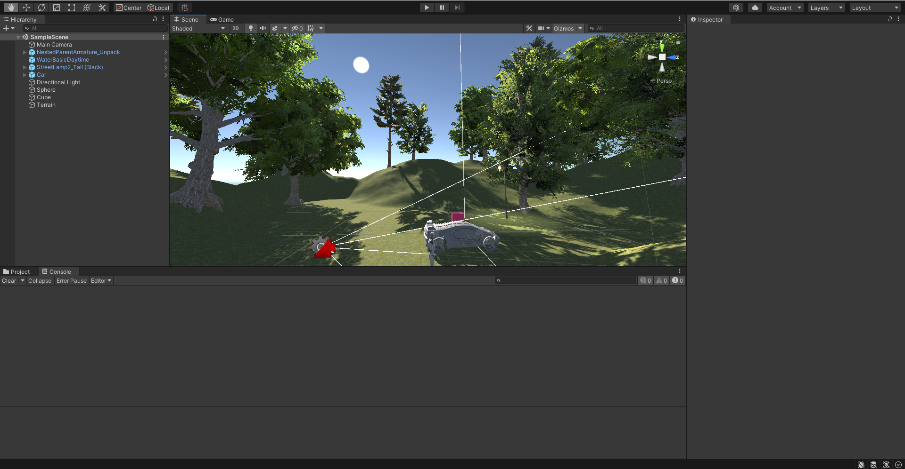
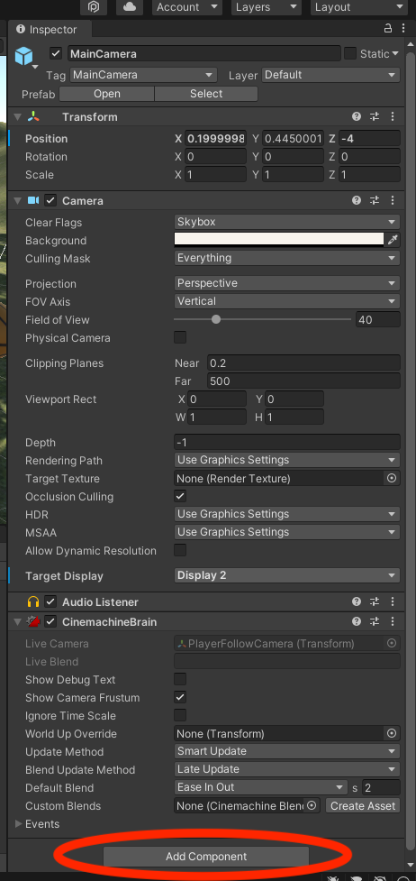

# Práctica 1 - Introducción a Unity
* **Asignatura:** Interfaces Inteligentes
* **Autor:** Marta Julia González Padrón
* **Correo:** alu0101254487@ull.edu.es

## Enunciado
Realizar una escena 3D básica utilizando exclusivamente el editor de escenas. La escena debe configurarse de la siguiente manera:

* Incluir objetos 3D básicos
* Incluir  algún objeto complejo de Standard Assets.
* Incluir un objeto libre de la Asset Store que no sea de los Standard Assets.
* Crear un terreno (opcional).
* Cada objeto debe tener una etiqueta que lo identifique.
* La escena debe tener 2 fuentes de luz.
* Utilizar prefabs de standard assets para un FPS o Third Person
* Agregar un script que escriba en la consola los objetos que se han utilizado, un identificador numérico que le asignes a cada uno de los objetos  y el valor de un contador que se actualiza en cada iteración para cada objeto. 

## Descripción del trabajo
### Incluir objetos 3D
Para incluir objetos 3D básicos como puede ser una esfera o un cubo, hay que hacer click en `GameObject/3D Object/Sphere` en la barra superior:

Además también se puede añadir un diseño a los objetos arrastrandoles una imagen:

Adicionalmente tambien es posible darle un color solido a los objetos en el siguiente botón del Inspector del objeto:

### Incluir  algún objeto complejo de Standard Assets
Para poder añadir un objeto de *Standart Assets* es necesario descargar primero el paquete entero en la *Asset Store* de *Unity*. Luego de importarlo ya se puede acceder a los objetos disponibles en los subdirectorios que contiene el paquete. En este caso se ha usado un coche. Para añadirlo a la escena es tan sencillo como dentro del proyecto, encontrar el directorioo de los Standard Assets y arrastrar el prefab elegido a la misma.

### Incluir un objeto libre de la Asset Store que no sea de los Standard Assets
En este punto se ha aprovechado el requisito [tener 2 fuentes de luz](#la-escena-debe-tener-2-fuentes-de-luz) para descargar de la *Asset Store* una farola. El proceso para llevar esto a cabo es el mismo que el anterior.

### Crear un terreno (opcional)
Para crear un terreno hay que ir a `GameObject/3D Object/Terrain` y se creara una especie de plano sobre nuestro eje horizontal.

Despues de crearlo se puede modificar en el panel de la derecha. Por ejemplo para añadir montañas es tan sencillo como tener seleccionado la siguiente opción y pulsar sobre el terreno.

Despues de esto es importante darle color al terreno. Para esto se crea un *Layer* y se escoge la piel que se le desea dar al terren: 

Otra opción que hay es añadirle árboles al terreno. Parecido a la opción de crear montañas, seleccionamos la opción de árboles y mas abajo podemos añadirlos.

Opcionalmente se ha añadido un pequeño lago. Para ello se ha hundido un poco el terreno y después se ha añadido dentro un objeto de agua descargado de la *Asset Store*.

### Cada objeto debe tener una etiqueta que lo identifique
Cabe destacar que a todos los objetos de este proyecto se les ha añadido una etiqueta o Tag. Eso se hace clicando sobre el objeto y en el Inspector de la derecha, arriba del todo se puede ver que el objeto por defecto esta *untagged*. Si clicamos ahi podemos añadirle una etiqueta.

### La escena debe tener 2 fuentes de luz
Ademas de aprovechar la luz por defecto que representa al sol. Se ha aprovechado también el objeto descargado de la *Asset Store* que es una Farola, por lo que es otra fuente de luz:

### Utilizar prefabs de standard assets para un FPS o Third Person
En este caso no se pudo usar los prefabs de standard assets para un jugador, ya que la documentación advierte que se use un pack actualizado si la versión de Unity usada es superior a la de 2018.

No obstante el proceso es el mismo. Es tan sencillo que ya viene incluido con controles para el móvil y una camara que persigue al personaje. Cabe destacar que las cámaras de Unity captan también el sonido, por lo que es recomendado desactivar la opción de captar el sonido si se tiene mas de una cámara, como es este caso.

### Agregar scripts
En *Unity* los scripts se añaden clicando sobre el objeto deseado y pulsando sobre `Add Component`. Despues solo se debe pulsar sobre `New Script` y en el fichero creado añadir el código necesario.

Los scripts de este proyecto debían cumplir los siguientes requisitos:
* Escribir en la consola los objetos que se han utilizado.
* Un identificador numérico que se le asigne a cada uno de los objetos.
* El valor de un contador que se actualiza en cada iteración para cada objeto. 

Por lo tanto los scripts para todos los objetos es el mismo, modificando el nombre de la clase e identificador.contendrán el siguiente código, igual para todos pero cambiando el nombre de la clase.

Cuando se ejecute el juego se podra comprobar por consola todas las cadenas que se han escrito:

## GIFs Demostrativos

